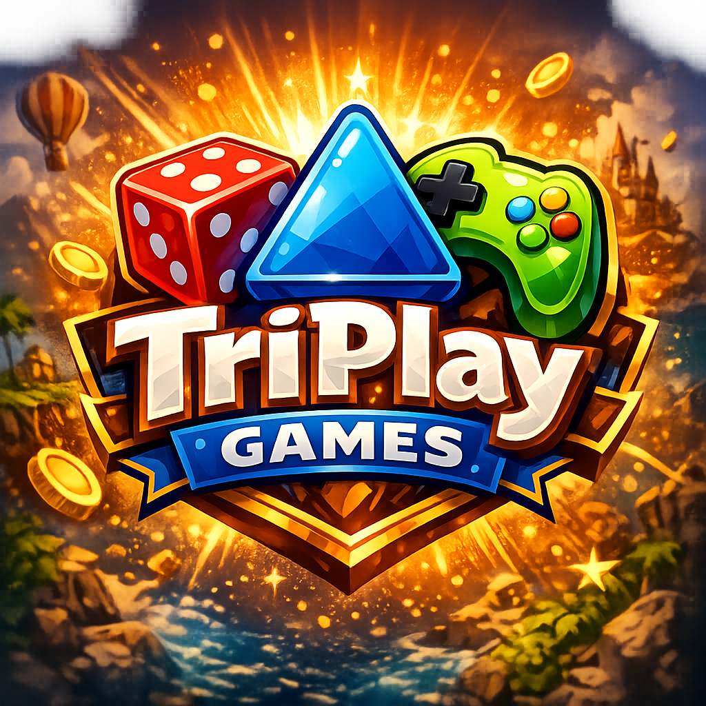

# TRIPLAY: THE THEATRE OF GAMES



**Triplay** is a sleek, neon-themed Flutter application that brings together a collection of classic and modern games under one atmospheric roof. Designed with a futuristic aesthetic, it offers a refined gaming experience with built-in statistics tracking and user personalization.

## 🌌 Features

- **Futuristic Neon UI**: A high-contrast, immersive design using deep blues and cyan accents, featuring glowing shadows and crisp typography.
- **System Initialization**: Personalized user onboarding that sets up your gaming profile within the "theatre."
- **Daily System Stats**: Track your performance in real-time with metrics for games played, total wins, and your win/loss ratio.
- **Persistent Progress**: Saves your username and gaming statistics locally using `shared_preferences`.
- **Multi-Platform**: Built with Flutter for a consistent experience across mobile, desktop, and web.

## 🎮 The Arcade

Triplay currently hosts a diverse range of games:

- **Tic Tac Toe**: The classic game of strategy, refined with a neon touch.
- **Ultimate Tic Tac Toe**: A complex, nested version of the classic for those seeking a greater challenge.
- **Chess**: The ultimate game of kings, beautifully rendered in the Triplay style.
- **Checkers**: A sleek implementation of the traditional board game.
- **Reaction Game**: Test your reflexes and speed against the system.
- **Pattern Memory**: Challenge your cognitive skills and memory retention.

## 🚀 Getting Started

### Prerequisites

- [Flutter SDK](https://docs.flutter.dev/get-started/install) (latest stable version)
- Dart SDK
- An Android/iOS emulator or a physical device

### Installation

1.  **Clone the repository:**
    ```bash
    git clone https://github.com/yourusername/triplay.git
    cd triplay
    ```

2.  **Install dependencies:**
    ```bash
    flutter pub get
    ```

3.  **Run the application:**
    ```bash
    flutter run
    ```

## 🛠️ Built With

- **Flutter** - The UI framework for building beautiful, natively compiled applications.
- **Shared Preferences** - For local data persistence (User Profile, Stats).
- **Custom Stats Engine** - Managed via `StatsManager` to track daily performance.

## 👤 Author

- **23HREE**

---
*TRIPLAY NEON - Initialize your gaming experience.*
